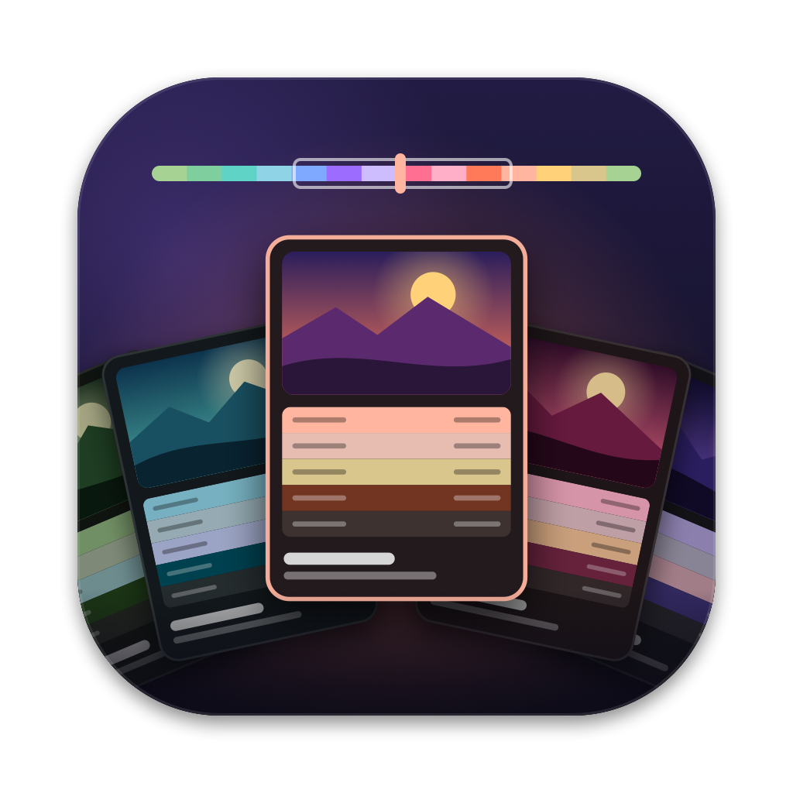
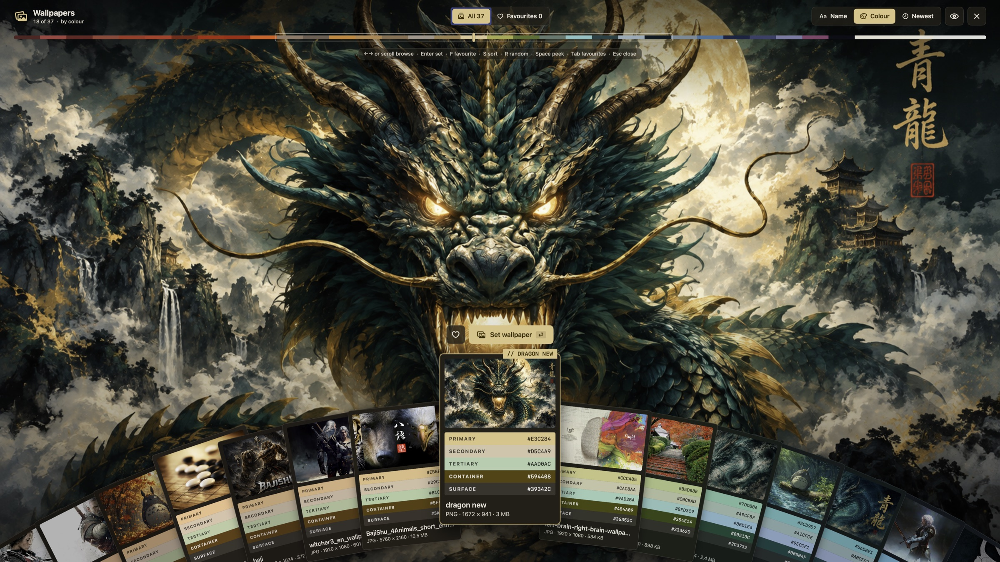

# Wallpaper Picker

A wallpaper picker for macOS. Your wallpapers are paint-chip cards fanned out
like a hand along the foot of the screen. Each card wears the Material-style
colour scheme read from its picture, and the card in front is previewed
full-screen behind the deck.

Inspired by [qs-wallpaperpicker](https://github.com/dhrruvsharma/qs-wallpaperpicker)
for Quickshell on Linux.



Requires macOS 14 or later.

## Install

No Xcode needed: the Command Line Tools are enough (`xcode-select --install`).

```sh
./bundle.sh --install
```

This builds `WallpaperPicker.app`, copies it to `~/Applications`, adds a
`wallpaper-picker` command to `~/.local/bin`, and (re)starts the app.

The app lives in the menu bar and has no Dock icon. Open the picker with **⌃⌥W**,
from the menu bar icon, or by opening the app again.

## Choosing the wallpaper folder

The default folder is `~/Pictures/Wallpapers`. To use another one:

```sh
wallpaper-picker --dir=~/Pictures/wallpapers
```

The app remembers the folder. If the app is running, it switches to the new
folder straight away; if not, the command starts it. You can also use
**Choose Folder…** in the menu bar.

It reads jpg, png, heic, webp, gif and tiff files. New files show up while the
app is running. Thumbnails and colours are cached in `~/Library/Caches/WallpaperPicker`.

```
wallpaper-picker [--dir=PATH] [--show]
  --dir=PATH   Take wallpapers from PATH (remembered; ~ works, also in quotes)
  --show       Open the picker
  --help       Show this help
```

## Keys

| | |
|---|---|
| `←` `→`, scroll, trackpad swipe, drag | browse |
| `Enter`, click the front card | set as wallpaper (all displays) |
| `F` | favourite |
| `S` | sort: name → colour → newest |
| `R` | random |
| `M` | fit: fill → fit → stretch → center (remembered per wallpaper) |
| `Space` | hold to peek, tap to toggle |
| `Tab` | all / favourites |
| `Home` `End` `PgUp` `PgDn` | jump |
| `Esc` | close |

## Notes

- macOS sets a wallpaper for the current Space only. Turn on **Show on all Spaces**
  in System Settings › Wallpaper to have it everywhere.
- With only the Command Line Tools installed, the build scripts use the macOS 26
  SDK. The macOS 27 SDK's SwiftUI needs a macro plugin that ships only with Xcode.

## Fitting the screen

Each wallpaper remembers how it meets the screen, like the menu in System Settings:
**Fill** (crop to cover), **Fit** (whole picture, the edges filled with its border
colour), **Stretch**, or **Center** (its own size). The preview shows the result
before you set it. Tile isn't offered: macOS has no public way for apps to set it.

## Development

```sh
./dev.sh                  # debug build, run from here, open the picker
./dev.sh --dir=~/folder   # with another folder (kept separate from the installed app)
./bundle.sh --install     # install when happy
```

Quit the installed app before `./dev.sh`, or both copies will want ⌃⌥W.

| File | What's in it |
|---|---|
| `main.swift`, `Options.swift` | command line, handing commands to the running app |
| `App.swift` | menu bar, global hotkey, the full-screen panel |
| `Library.swift` | the folder: scanning, watching, favourites, analysis queue |
| `Images.swift` | thumbnails, previews, caches |
| `ColorScience.swift` | Lab colour, seed extraction, the tonal scheme |
| `Motion.swift` | display-linked animation of the deck |
| `PickerModel.swift` | the hand's geometry, state, keys and scrolling |
| `PickerView.swift` | everything on screen |

## Licence

[GPL-3.0](LICENSE), the same as qs-wallpaperpicker, whose design and card
layout this app is modelled on.
